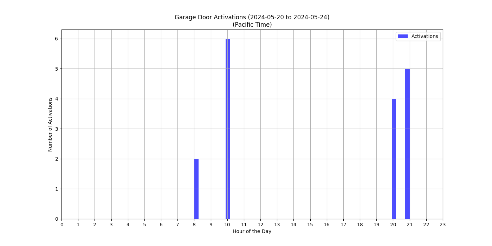

# Garage Insights



## Overview

Garage Insights is a program designed to analyze the activation patterns of a garage door using historical data from Home Assistant. The program fetches data, processes it, generates informative plots, and uploads these visualizations to Google Drive for easy access and sharing.

## Features

- **Data Retrieval**: Fetches historical data from Home Assistant based on specified time periods.
- **Data Processing**: Normalizes and processes the data to extract meaningful insights.
- **Visualization**: Creates detailed plots showing garage door activation patterns over a 24-hour period.
- **Cloud Integration**: Uploads the generated plots to Google Drive, making them accessible from anywhere.
- **Automation**: Can be scheduled to run periodically using cron jobs for continuous monitoring and analysis.

## Benefits

- **Insightful Analysis**: Provides valuable insights into the usage patterns of your garage door.
- **Automated Reporting**: Eliminates the need for manual data collection and reporting by automating the entire process.
- **Accessibility**: Stores visual reports in Google Drive, allowing easy sharing and access from any device.
- **Customizable**: Easily adaptable to other use cases by modifying the data processing and visualization logic.

## Personal Note

I started this project by uploading the historical data from my Home Assistant to ChatGPT to analyze and gain insights into my garage door usage related to my daily routine. This helped me understand my comings and goings over the past week. To automate this process, I decided to develop a script that not only analyzes the data but also uploads the results to Google Drive. This way, I can easily see when I left and returned home throughout the past week.

## Setup

To set up Garage Insights, follow these steps:

1. Clone the Repository

```bash
git clone https://github.com/davidyen1124/Garage-Insights.git
cd garage-insights
```

2. Create and Configure the Environment File
   Copy the .env.example file to .env:

```bash
cp .env.example .env
```

Edit the .env file to include your specific configuration details:

```bash
HOME_ASSISTANT_URL=https://your-home-assistant-url.com
HOME_ASSISTANT_TOKEN=your_home_assistant_token
ENTITY_ID=your_entity_id
BASE_DIR=/path/to/your/project
DRIVE_FOLDER_ID=your_google_drive_folder_id
```

Getting Your Home Assistant Token

- Log in to your Home Assistant instance.
- Navigate to your user profile by clicking on your username in the bottom left corner.
- Scroll down to the "Long-Lived Access Tokens" section.
- Create a new token and copy it to the `HOME_ASSISTANT_TOKEN` field in the .env file.

Setting Up Google Drive Integration

- Follow the instructions to enable the Google Drive API.
- Download the credentials file and save it in your project directory.
- Set the `DRIVE_FOLDER_ID` in the `.env` file to the ID of the folder where you want to upload the plots.

3. Install Dependencies
   Use pip to install the required dependencies:

```bash
pip install -r requirements.txt
```

4. Run the Daily Spreadsheet Script
   Execute the script to fetch data and upload it to Google Spreadsheet:

```bash
python generate_daily_spreadsheet.py
```

5. Run the Weekly Chart Script
   Execute the script to generate and upload the weekly data chart:

```bash
python generate_weekly_chart.py
```

6. (Optional) Automate with Cron Job
   To run the scripts periodically, you can set up a cron job. Open the cron job editor:

```bash
crontab -e
```

Add the following line to schedule the daily spreadsheet script (e.g., to run daily at midnight):

```bash
0 0 * * * /usr/bin/python3 /path/to/your/project/generate_daily_spreadsheet.py
```

And add the following line to schedule the weekly chart script (e.g., to run every Sunday at midnight):

```bash
0 0 * * 0 /usr/bin/python3 /path/to/your/project/generate_weekly_chart.py
```

## License

This project is licensed under the MIT License. See the LICENSE file for details.
